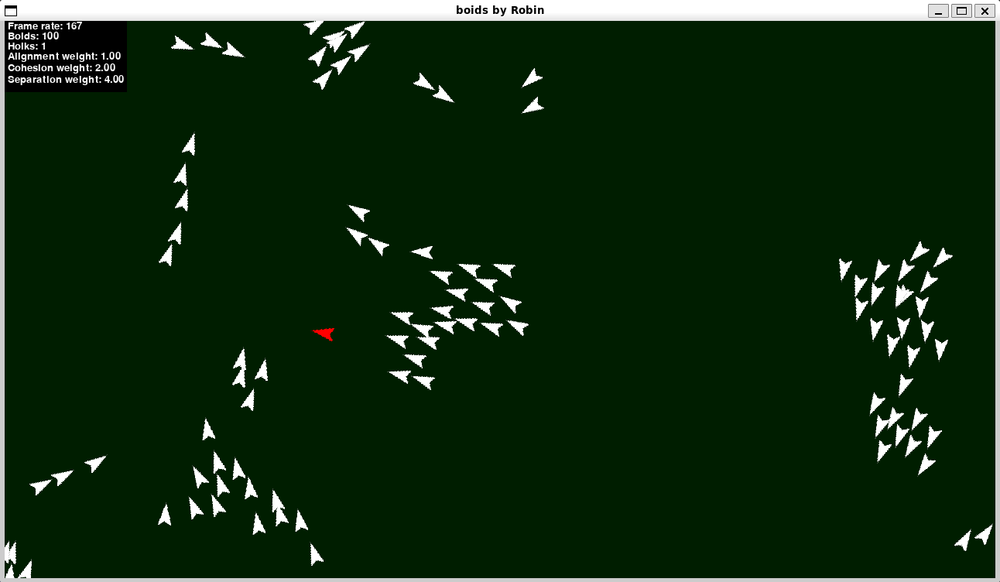

# Boids

My take on the flock simulation [Boids](https://en.wikipedia.org/wiki/Boids) originally developed by Craig Reynolds in 1986. Implemented as part of a mandatory assignment in INF-1400 at UiT.



## Quick start
```console
$ python3 main.py
```

As well as using right mouse click to add boids you can adjust the three factors used in the algorithm as stated below.

## Controls
|Key|Action|
|--|--|
|<kbd>Any mouse button</kbd>|Add boid|
| <kbd>R</kbd> | Reset |
| <kbd>Q</kbd> | Quit |
| <kbd>1</kbd> | Decrease alignment |
| <kbd>2</kbd> | Increase alignment |
| <kbd>3</kbd> | Decrease cohesion |
| <kbd>4</kbd> | Increase cohesion |
| <kbd>5</kbd> | Decrease separation |
| <kbd>6</kbd> | Increase separation |
